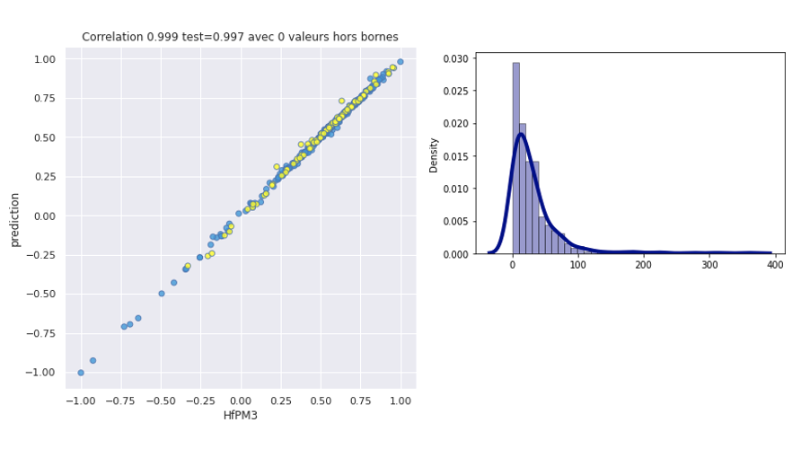

# Formulate

Formulate is a library to build and manipulate formulations. It can be use for materials, cosmetics or any activities
involving mixing of components. This version computes oxygen balance, eutectic points, equilibrium temperature by deep learning.
The purpose of this library is allowing a way to build deep learning datasets for materials and formulations.


## Package install
```
pip install https://github.com/l0d0v1c/formulate/blob/main/dist/formulate-1.3-py3-none-any.whl?raw=true
```

## Documentation

https://l0d0v1c.github.io/formulate/

## Basic object

The main object is 'components' and called by from components import components 
```
c=components(physical={"Hf":True,"rho":None}) 
c.add("Water","H2O",{'Hf':-285.83,"rho":1.0}) 
c.add("Nitrogen","N2",{'Hf':0,"rho":0.01}) 
c.add("Oxygen","O2",{'Hf':0,"rho":0.01})
```

The physical dictionary contains a list of physical properties that can be set True for the one that are additives (like enthaply, False when they depends on mass but are not additives (like heat of fusion), None when they are mass independant and non-additive (like temperature)

Addition .add takes the name of the component, a raw formula and a dictionary of physical properties. The raw formula may include all possible atoms in any order. The mixture is stored in .mixture
```
c.mixture
{'Water': {'H': 111.017, 'O': 55.508, 'Hf': -15865.97, 'rho': 1.0, 'N': 0},
 'Nitrogen': {'N': 71.394, 'Hf': 0.0, 'rho': 0.01, 'O': 0, 'H': 0},
 'Oxygen': {'O': 62.502, 'Hf': 0.0, 'rho': 0.01, 'N': 0, 'H': 0}}
 ```

 The atoms amount are converted in ATG/kg as well as physical properties (True|False) as per kg.
 The rates are defined by .setrates
 ```
 c.setrates({"Water":0.5,"Nitrogen":0.25,"Oxygen":0.25})
 c.mixing()
 ```
 .mixing outputs a table of the formulation

|    | Component   |   Rate |        H |       O |       N |        Hf | rho          |
|---:|:------------|-------:|---------:|--------:|--------:|----------:|:-------------|
|  0 | Water       |   0.5  | 111.017  | 55.508  |  0      | -15866    | 1.0          |
|  1 | Nitrogen    |   0.25 |   0      |  0      | 71.394  |      0    | 0.01         |
|  2 | Oxygen      |   0.25 |   0      | 62.502  |  0      |      0    | 0.01         |
|  3 | Formulation |   1    |  55.5085 | 43.3795 | 17.8485 |  -7932.98 | Non additive |

c.formulationtab produces

 |    | Component   |   Rate |       H |       O |       N |       Hf | rho          |
 |---:|:------------|-------:|--------:|--------:|--------:|---------:|:-------------|
 |  0 | Formulation |      1 | 55.5085 | 43.3795 | 17.8485 | -7932.98 | Non additive |'

 ## Processed formula

 The following processed data are available:
 * c.formulationtab : a pandas dataframe of the final formulation
 * c.formulationlist : a pandas dataframe of components
 * c.formulation : a formulation dictionary

 ## Models

 ### Oxygen balance 
 c.oxygenbalance() gives the oxygen balance for C,H,N,O mixtures (https://en.wikipedia.org/wiki/Oxygen_balance). For instance for an energetic mixture:
 |    | Component   |   Rate |       H |       O |       N |       C |       Hf |
 |---:|:------------|-------:|--------:|--------:|--------:|--------:|---------:|
 |  0 | TNT         |   0.75 | 22.014  | 26.416  | 13.208  | 30.819  | -294.983 |
 |  1 | RDX         |   0.25 | 27.013  | 27.013  | 27.013  | 13.506  |  355.669 |
 |  2 | Formulation |   1    | 23.2638 | 26.5653 | 16.6593 | 26.4907 | -132.32  |

 ```
HT=components(physical={'Hf':True})
HT.add("TNT","C7H5N3O6",{"Hf":-67})
HT.add("RDX","C3H6N6O6",{"Hf":79})
HT.setrates({'TNT':0.75,'RDX':0.25})
HT.mixing()
HT.oxygenbalance()
 ```
should gives -60.88 %

 ### Eutectic
c.eutectic(underrelax=0.01) allow the computation of eutectic points. In this case, raw formula is not required but the physical properties must include Tfus (melting point in K) and Hfus (melting enthalpy in J/mol). For instance to find the eutectic point of LiF/NaF/KF mixture:
```
eutec=components(physical={"Hfus":None,"Tfus":None})
eutec.add("KF","",{"Hfus":28500,"Tfus":856+273})
eutec.add("LiF","",{"Hfus":10000,"Tfus":845+273})
eutec.add("NaF","",{"Hfus":32600,"Tfus":985+273})
eutec.setrates({"KF":1,"LiF":1,"NaF":1})
eutec.mixing()
T=eutec.eutectic()
eutec.formulationlist
```
|    | Component   |   Rate | Hfus         |   Tfus |
|---:|:------------|-------:|:-------------|-------:|
|  0 | KF          |  0.244 | 28500        |   1129 |
|  1 | LiF         |  0.616 | 10000        |   1118 |
|  2 | NaF         |  0.14  | 32600        |   1258 |
|  3 | Formulation |  1     | Non additive |    771 |


underrelax defines the under relaxation of Newton-Raphson algorithm. Please refer to:
```
Brunet, L., J. Caillard, et P. André. « Thermodynamic calculation of n-component 
eutectic mixtures ». International Journal of Modern Physics C 15, nᵒ 5 (2004): 675‑87. 
https://doi.org/10.1142/S0129183104006121
```

## Equilibrium temperature
c.equilibrium() returns the equilibrium temperature (K) of the mixture for C,H,O,N components and 1 atm. This is an experimental feature based on a simple feedworward neural network trained on 100k equilibrium assessed by free enthalpy minimization. Please refer to
```
Brunet, L., N. Forichon‐Chaumet, J. M. Lombard, et A. Espagnacq. « Modelisation of Combustion
Equilibria with Monte-Carlo Numerical Method ». Propellants, Explosives, Pyrotechnics 22,
nᵒ 6 (1997): 311‑13. https://doi.org/10.1002/prep.19970220602.
```

## Enthalpy of formation
A neural network trained on AM1/PM3 hamiltonian of MOPAC is implemented to compute a 298K gas enthalpy of formation for organic unknown molecules.
Please refer to MOPAC documentation to properly use it.
For instance adding a molecule requires also the canonical SMILES representation like
```
Mix.add("Ethanol","C2H6O",{'Hf':Mix.enthalpyf("CCO",hamiltonian="AM1")})
```
Despite of a quite good and very quick prediction of the full quantum mechanics code outputs, this version using only a two layers neural networks there is still a relative unaccuracy.


Fig1: PM3 prediction and distribution of absolute gap

*rem:a more accurate version is a part of AlchemAI @ https://www.alysophil.com*

```
Computational Chemistry, David Young, Wiley-Interscience, 2001. Appendix A. A.3.2 pg 342, MOPAC
```


## Customizing

By default, all the results are displayed with 3 decimals. It can be changed at initialization like
```
c=components(physical={"Hf":True,"rho":None,"something":False}, rond=7) 

```

## Running test

A MyBinder instance allows to run this version:

[](https://mybinder.org/v2/gh/l0d0v1c/formulate/HEAD?filepath=%2Ftests%2Ftests.ipynb)

## Participate

This is a public version of the library. If you want to join our research project, feel free to contact us at https://www.rd-mediation.fr/wp/contact/


## Cite
```
@misc{Brunet2021,
  author = {Brunet, L.E.},
  title = {Formulate: a python library for formulation},
  year = {2021},
  publisher = {GitHub},
  journal = {GitHub repository},
  howpublished = {\url{https://github.com/l0d0v1c/formulate}},
  commit = {9d44a5c479f52ba47b4ec5e6c7c59b833daa471d}
}
```

